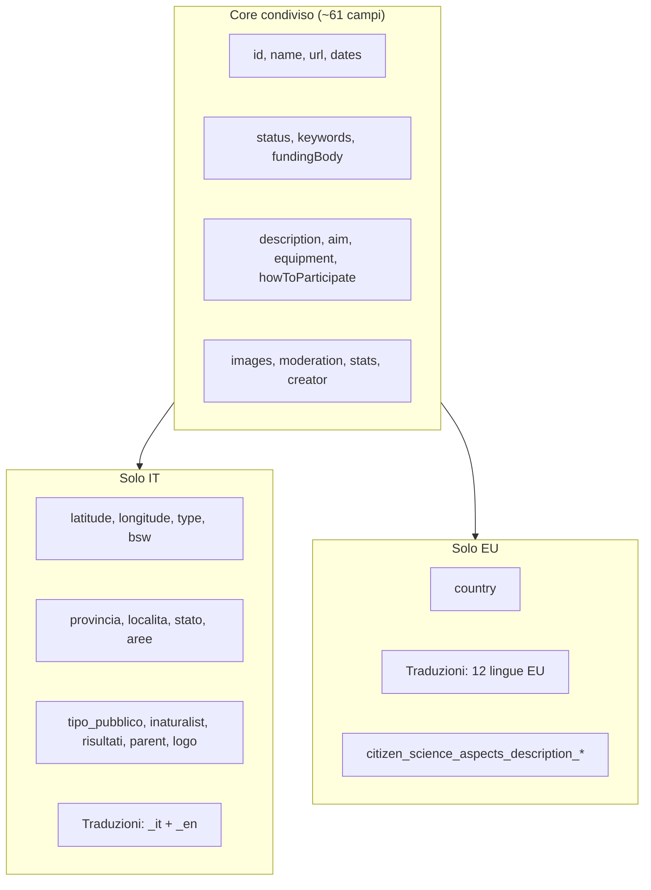

## Panoramica

Entrambe le API espongono lo stesso endpoint Django REST (`GET /api/project/{id}`) e condividono lo stesso **schema di base** (progetto citizen science ECSA). La piattaforma italiana ([project/24](https://piattaforma.citizenscience.it/api/project/24)) è un fork/localizzazione con **campi aggiuntivi** e **meno lingue**; la piattaforma europea ([project/651](https://citizenscience.eu/api/project/651)) è la versione **multilingue completa** dell’hub EU.

| Aspetto | IT (`piattaforma.citizenscience.it`) | EU (`citizenscience.eu`) |
|---|---|---|
| Campi top-level | **76** | **114** |
| Campi solo qui | **15** | **53** |
| Campi comuni | **61** | **61** |

---

## 1. Internazionalizzazione (differenza principale)

### Piattaforma IT — solo italiano e inglese
Suffissi lingua sui campi testuali: `_it`, `_en`

```python
# src/eucs_platform/settings/base.py
MODELTRANSLATION_LANGUAGES = ('it','en')
```

Campi tradotti sul progetto:
- `description`, `description_it`, `description_en`
- `aim`, `aim_it`, `aim_en`
- `howToParticipate`, `howToParticipate_it`, `howToParticipate_en`
- `equipment`, `equipment_it`, `equipment_en`

`citizen_science_aspects_description` **non** ha varianti `_it`/`_en` (non è registrato in `ProjectTranslationOptions`).

### Piattaforma EU — 12 lingue
Suffissi: `_en`, `_es`, `_pt`, `_nl`, `_et`, `_fr`, `_de`, `_el`, `_hu`, `_it`, `_lt`, `_sv`

Stessi campi testuali, ma con tutte le varianti, incluso:
- `citizen_science_aspects_description_*` (13 varianti)
- `description_*`, `aim_*`, `howToParticipate_*`, `equipment_*`

Anche gli oggetti annidati sono multilingue:

| Oggetto | IT | EU |
|---|---|---|
| `status` | `status`, `status_it`, `status_en`, `status_code` | + 10 lingue (`status_de`, `status_fr`, …) |
| `difficultyLevel` | `difficultyLevel`, `_it`, `_en` | + 10 lingue |
| `topic[]` | (se popolato: solo `topic`, `_it`, `_en`) | + 10 lingue |
| `hasTag[]` | (se popolato: solo `_it`, `_en`) | + 10 lingue |
| `participationTask[]` | idem | + 10 lingue |
| `geographicextend[]` | **solo** `id` + `geographicextend` (nessuna traduzione) | traduzioni complete se popolato |

---

## 2. Campi presenti solo sulla piattaforma IT (15)

Estensioni specifiche per il contesto italiano / Biodiversity Sampling Week:

| Campo | Tipo | Esempio (proj. 24) | Significato |
|---|---|---|---|
| `latitude` / `longitude` | string (decimal) | `"45.322500"`, `"8.430000"` | Coordinate geografiche |
| `type` | string | `"Attività"` | Tipo: progetto vs attività |
| `bsw` | string | `"2025"` | Anno Biodiversity Sampling Week |
| `provincia` | array di ID | `[65]` | Province italiane (M2M) |
| `localita` | int (FK) | `1` | Riferimento a tabella località |
| `stato` | string/null | `null` | Stato progetto custom |
| `aree` | JSON/null | `null` | Aree geografiche strutturate |
| `tipo_pubblico` | string | `"pubblico generico"` | Target audience |
| `tipo_pubblico_altro` | string/null | `null` | Altro target |
| `inaturalist` | string/null | `null` | Link iNaturalist |
| `risultati` | string/null | `null` | Risultati |
| `parent` | int/null | `null` | Progetto padre (gerarchia) |
| `logo` / `logoCredit` | image/null | `null` | Logo separato dalle image1-3 |

Nel codice locale, il serializer esclude esplicitamente `country`:

```104:107:src/projects/api/serializers.py
    class Meta:
        model = Project
        #fields = '__all__'
        exclude = ['country']
```

---

## 3. Campi presenti solo sulla piattaforma EU (53)

Tutti legati al **supporto multilingue esteso** (53 campi = varianti `_de`, `_el`, `_es`, … su 5 blocchi testuali) più:

| Campo | Note |
|---|---|
| `country` | Paese del progetto (escluso dall’API IT) |

Non ha nessuno dei 15 campi custom italiani sopra.

---

## 4. Oggetti annidati — struttura diversa

### `geographicextend`
- **IT**: oggetto minimale, senza traduzioni
  ```json
  { "id": 3, "geographicextend": "Provinciale" }
  ```
- **EU**: quando popolato, include `geographicextend_en`, `geographicextend_de`, ecc.

### `mainOrganisation` / `organisation`
Struttura identica (`id`, `name`, `url`), ma i valori differiscono (IT popolata, EU spesso `null`/vuota).

### `keywords`, `fundingBody`
Struttura identica (`id` + testo), solo i dati cambiano.

---

## 5. Campi comuni con differenze di contenuto/formato

| Campo | IT | EU |
|---|---|---|
| `description` | testo plain | HTML ricco (`<p>`, `<strong>`, stili inline) |
| `imageCredit1/2/3` | `null` | spesso `""` (stringa vuota) |
| `fundingProgram` | `null` | `""` |
| `hasTag` | array vuoto `[]` | popolato con oggetti multilingue |
| `topic` | array vuoto | popolato (3 topic) |
| `participationTask` | array vuoto | popolato |

---

## 6. Schema concettuale



---

## Implicazioni pratiche

Se devi **consumare entrambe le API** o **sincronizzare dati** tra le piattaforme:

1. **Non assumere lo stesso set di chiavi** — verifica sempre la presenza del campo (`country`, `latitude`, ecc.).
2. **Gestisci due strategie i18n** — IT: fallback `it` → `en`; EU: fino a 12 lingue con suffisso `_xx`.
3. **Mappa i campi custom IT** (`provincia`, `type`, `bsw`, …) se importi verso EU, dove non esistono equivalenti diretti.
4. **`country` è escluso** dall’API IT ma presente su EU (anche se vuoto nel progetto 651).
5. **`geographicextend` e `hasTag`** hanno strutture diverse a seconda della piattaforma e del popolamento.
6. **`citizen_science_aspects_description`** su IT è un solo campo; su EU ha varianti per lingua.

In sintesi: stesso DNA ECSA, ma la piattaforma IT è una **versione regionalizzata** (geo italiana, BSW, 2 lingue), mentre citizenscience.eu è la **versione pan-europea** con i18n completo.